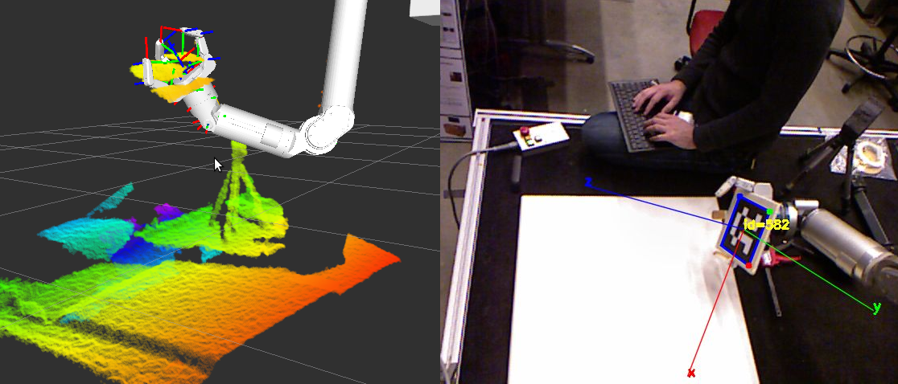

ARUCO / VISP Hand-Eye Calibration
=================================



实验使用的标定包是 <https://github.com/jhu-lcsr/aruco_hand_eye>  git clone到~/catkin_ws/src/中并编译

或者使用我在realsense sr300和kinova j2s7s300上测试过的代码 https://github.com/FeiYuejiao/aruco_hand_eye

使用aruco在线生成网站生成marker  <http://chev.me/arucogen/>  


生成的图像如下，由于打印机打印出来的尺寸可能有偏差，不是100mm，在打印出来以后自己测量真实尺寸就行。


启动realsense，查看有哪些frame可以选择，我选的是camera_aligned_depth_to_color_frame下面的camera_color_optical_frame because aruco uses rgb image and depth frame is aligned to color frame here：

```roslaunch roslaunch realsense2_camera rs_rgbd.launch ```

```rosrun rqt_tf_frame rqt_tf_frame```


在官方readme中给了eye-in-hand和eye-on-base两种情况，本实验使用的是eye-on-base，就是相机固定位置，maker固定在机械臂末端。参考eye-on-base新建一个kinova.launch文件：

```xml
<launch>
  <!-- The end-effector frame_id, depend on what robot you use -->
  <arg name="ee_frame" value="/j2s7s300_end_effector"/>

  <!-- Bring up a realsense -->
  <include file="$(find realsense2_camera)/launch/rs_rgbd.launch">
  </include>

 <!-- Calibrate the extrinsics for a realsense mounted to a robot base -->
 <!-- User need to specify markerid and markersize -->
  <include file="$(find aruco_hand_eye)/launch/aruco_hand_eye.launch">
    <arg name="markerid"   value="571"/>
    <arg name="markersize" value="0.100"/>
    <arg name="publish_tf" value="true"/>
    
  <!-- In eye-on-base case, marker_parent_frame is the end-effector frame, camera_parent_frame is the world or base frame -->
    <arg name="marker_parent_frame" value="$(arg ee_frame)"/>
    <arg name="camera_parent_frame" value="/world"/>
    <arg name="camera" value="/camera/color/"/>
    <!-- Here I use the realsense's camera_color_optical_frame because aruco uses rgb image and depth frame is aligned to color frame here -->
    <arg name="camera_frame" value="/camera_color_optical_frame"/>
  </include>

</launch>
```

启动kinova     ```roslaunch kinova_bringup kinova_robot.launch kinova_robotType:=j2s7s300 ```

启动arucu_hand_eye   ```roslaunch aruco_hand_eye kinova.launch ```

打开rviz	```rosrun rviz rviz``` 

你可以使用moveIt!对kinova进行控制，easy_hand_eye中就是这样的，但是调了半天没调通，我才使用aruco_hand_eye，只要给它/j2s7s300_end_effector 的frame信息就够了。

rviz中看aruco_tracker_result 是这样的有些角度可能没有坐标系产生，这些位置就不能用。


如果一切顺利，在```roslaunch aruco_hand_eye kinova.launch```窗口应该出现下面的命令行，每capture一个sample，控制机器人末端变换一定的角度或者位置，因为我对moveit!还不是很熟悉，为了方便直接使用的joystick。capture 3张图后计算出的平移和旋转如下，看平移已经比较接近我测量的真实值，但是可以多capture几张，我一般控制在20张左右。有些位置结果不太好要discard。


真实的实验环境：


下方是aruco_hand_eye官方的readme内容供参考～

## Use Cases

This package uses the ARUCO planar target tracker from `aruco_ros` and the VISP
hand-eye calibration from `visp_hand2eye_calibration` to provide a simple
camera pose estimation package.

If you're unfamiliar with Tsai's hand-eye calibration [1], it can be used in two ways:

- **eye-in-hand** -- To compute the static transform from a robot's
  end-effector to the optical frame of a camera. In this case, the camera is
  mounted on the end-effector, and you place the visual target so that it is
  fixed relative to the base of the rboot.
- **eye-on-base** -- To compute the static transform from a robot's base to the
  optical frame of a camera. In this case, the camera is mounted to the base of
  the robot (or kinematic chain), and you place the visual target so that it is
  fixed relative to the end-effector of the robot.

## Usage

For both use cases, you can either launch the `aruco_hand_eye.launch`
launchfile, or you can include it in another launchfile as shown below. Either
way, the launchfile will bring up the `aruco_ros` tracker and the
`visp_hand2eye_calibration` solver, along with an integration script. By
default, the integration script will interactively ask you to accept or discard
each sample.

### eye-in-hand

```xml
<launch>
  <include file="$(find aruco_hand_eye)/launch/aruco_hand_eye.launch">
    <arg name="markerid"   value="582"/>
    <arg name="markersize" value="0.141"/>
    <arg name="publish_tf" value="true"/>

    <arg name="marker_parent_frame" value="/base_link"/>
    <arg name="camera_parent_frame" value="/ee_link"/>

    <arg name="camera" value="/camera/rgb"/>
    <arg name="camera_frame" value="/camera_rgb_optical_frame"/>
  </include>
</launch>
```

### eye-on-base

```xml
<launch>
  <include file="$(find aruco_hand_eye)/launch/aruco_hand_eye.launch">
    <arg name="markerid"   value="582"/>
    <arg name="markersize" value="0.141"/>
    <arg name="publish_tf" value="true"/>

    <arg name="marker_parent_frame" value="/ee_link"/>
    <arg name="camera_parent_frame" value="/base_link"/>

    <arg name="camera" value="/camera/rgb"/>
    <arg name="camera_frame" value="/camera_rgb_optical_frame"/>
  </include>
</launch>
```

## Examples

For calibrating a kinect mounted to the base of a manipulator that can grasp the target:

```
roslaunch aruco_hand_eye kinect.launch ee_frame:=/my/robot/ee_link
```

## References

[1] *Tsai, Roger Y., and Reimar K. Lenz. "A new technique for fully autonomous
and efficient 3D robotics hand/eye calibration." Robotics and Automation, IEEE
Transactions on 5.3 (1989): 345-358.*


